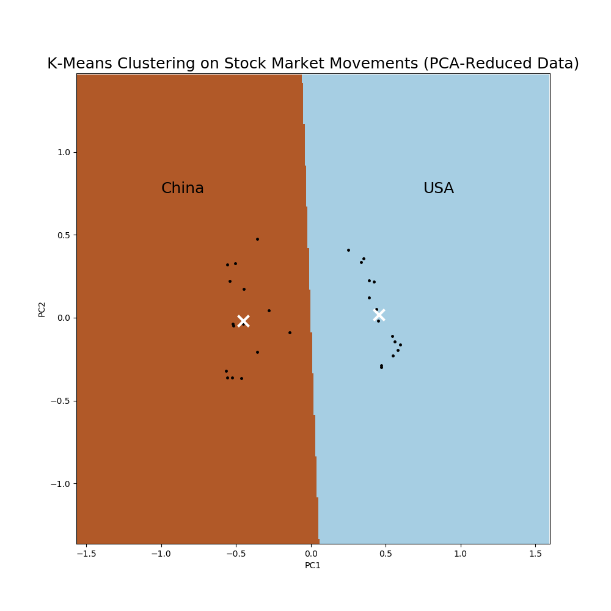

# U.S. vs. China Stock Clustering

## Introduction
In this project, I used KMeans Clustering to guess whether a company is based in the U.S. or China based on their stock price information.  

The stock price data I used was gathered by Yahoo Finance and it included daily data for 30 companies from Jan 1, 2017 to Aug 24, 2020.  The data was gathered form the New York and Honk Kong stock exchanges.  This data included Date, Open Price, Close Price, Adjusted Close, High, Low, and Volume.    

Using a dictionary of Chinese and American companies, I extracted the open and close prices to create a daily movement of the stock price.  There were some missing points for a few Chinese companies so I replaced those values in the movement table with the average movement for that company.

## Company Average Movements
|          Company                       |            Average Movement |
|:--------------------------------|-------------:|
| ('Apple', 'AAPL')               |    0.20361   |
| ('Amazon', 'AMZN')              |    0.261167  |
| ('Berkshire Hathaway', 'BRK-B') |   -0.0931885 |
| ('Facebook', 'FB')              |    0.129267  |
| ('Google', 'Googl')             |    0.583935  |
| ('Home Depot', 'HD')            |    0.107244  |
| ('Intel', 'INTC')               |    0.0238111 |
| ('Johnson and Johnson', 'JNJ')  |    0.0168888 |
| ('JP Morgan Chase', 'JPM')      |   -0.0149    |
| ('Mastercard', 'MA')            |    0.0477113 |
| ('Microsoft', 'MSFT')           |    0.0275444 |
| ('Proctor and Gamble', 'PG')    |    0.0652668 |
| ('United Healthcare', 'UNH')    |    0.0343664 |
| ('Visa', 'V')                   |    0.0289889 |
| ('Verizon', 'VZ')               |    0.0010222 |
| ('HSBC', '0005.HK')             | -162.211     |
| ('Tencent', '0700.HK')          |  -18.0844    |
| ('CCB', '0939.HK')              |  -24.5833    |
| ('China Mobile', '0941.HK')     |  -13.3751    |
| ('ABC', '1288.HK')              | -146.587     |
| ('AIA', '1299.HK')              |  -16.014     |
| ('ICBC', '1398.HK')             |   -5.53031   |
| ('PSBC', '1658.HK')             |  -16.8602    |
| ('PING AN', '2318.HK')          |   -3.90908   |
| ('CHINA LIFE', '2628.HK')       |  -24.3417    |
| ('Meituan', '3690.HK')          |  -18.767     |
| ('CM BANK', '3698.HK')          |  -12.3619    |
| ('Bank of China', '3988.HK')    |  -30.3586    |
| ('JD.com', '9618.HK')           |  -33.9905    |
| ('Alibaba', '9988.HK')          |  -23.9164    |

  

## KMeans Implementation
Before utilizing the kmeans clustering, I normalized the data so that the clusters did not simply cluster based on the raw stock price of the movements.  After normalizing, I used my kmeans pipeline to predict the cluster for each company.   

|          Company                       |            Label |
|:--------------------------------|-------------:|
| ('Apple', 'AAPL')               |    0  |
| ('Amazon', 'AMZN')              |    0  |
| ('Berkshire Hathaway', 'BRK-B') |   0|
| ('Facebook', 'FB')              |    0  |
| ('Google', 'Googl')             |    0  |
| ('Home Depot', 'HD')            |    0  |
| ('Intel', 'INTC')               |    0 |
| ('Johnson and Johnson', 'JNJ')  |    0 |
| ('JP Morgan Chase', 'JPM')      |  0  |
| ('Mastercard', 'MA')            |    0 |
| ('Microsoft', 'MSFT')           |    0 |
| ('Proctor and Gamble', 'PG')    |    0 |
| ('United Healthcare', 'UNH')    |    0|
| ('Visa', 'V')                   |    0 |
| ('Verizon', 'VZ')               |    0 |
| ('HSBC', '0005.HK')             | 1     |
| ('Tencent', '0700.HK')          |  1    |
| ('CCB', '0939.HK')              |  1    |
| ('China Mobile', '0941.HK')     |  1    |
| ('ABC', '1288.HK')              | 1     |
| ('AIA', '1299.HK')              |  1    |
| ('ICBC', '1398.HK')             |   1   |
| ('PSBC', '1658.HK')             | 1    |
| ('PING AN', '2318.HK')          |   1   |
| ('CHINA LIFE', '2628.HK')       |  1    |
| ('Meituan', '3690.HK')          |  1    |
| ('CM BANK', '3698.HK')          |  1   |
| ('Bank of China', '3988.HK')    |  1  |
| ('JD.com', '9618.HK')           |  1    |
| ('Alibaba', '9988.HK')          |  1    |

Great!  The clusters accurately predicted which country each company belonged to.  Let's find another way to visualize this.  
## PCA Implementation
I performed linear dimensionality reduction with PCA and then ran the kmeans clustering algorithm on the reduced data.  The results are now shown in a meshgrid.  

|   labels | companies                       |
|---:|---------:|:--------------------------------|
|        0 | ('Apple', 'AAPL')               |
|        0 | ('Visa', 'V')                   |
|        0 | ('United Healthcare', 'UNH')    |
|        0 | ('Proctor and Gamble', 'PG')    |
|        0 | ('Microsoft', 'MSFT')           |
|        0 | ('Mastercard', 'MA')            |
|        0 | ('JP Morgan Chase', 'JPM')      |
|        0 | ('Verizon', 'VZ')               |
|       0 | ('Intel', 'INTC')               |
|         0 | ('Home Depot', 'HD')            |
|        0 | ('Google', 'Googl')             |
|         0 | ('Facebook', 'FB')              |
|       0 | ('Berkshire Hathaway', 'BRK-B') |
|      0 | ('Amazon', 'AMZN')              |
|        0 | ('Johnson and Johnson', 'JNJ')  |
|        1 | ('Bank of China', '3988.HK')    |
|        1 | ('CM BANK', '3698.HK')          |
|        1 | ('Meituan', '3690.HK')          |
|        1 | ('CHINA LIFE', '2628.HK')       |
|        1 | ('PING AN', '2318.HK')          |
|         1 | ('PSBC', '1658.HK')             |
|         1 | ('China Mobile', '0941.HK')     |
|        1 | ('AIA', '1299.HK')              |
|         1 | ('ABC', '1288.HK')              |
|        1 | ('CCB', '0939.HK')              |
|       1 | ('Tencent', '0700.HK')          |
|         1 | ('HSBC', '0005.HK')             |
|         1 | ('JD.com', '9618.HK')           |
|        1 | ('ICBC', '1398.HK')             |
|        1 | ('Alibaba', '9988.HK')          |

  
## Testing
From these tables, the pipeline appropriately put each company.  Does it work on a new company as well?

I tried this by inputting a new company (Tesla) into the list and running it through the pipeline.
|    |   labels | companies                       |
|---:|---------:|:--------------------------------|
|  0 |        0 | ('Apple', 'AAPL')               |
| 14 |        0 | ('Verizon', 'VZ')               |
| 13 |        0 | ('Visa', 'V')                   |
| 12 |        0 | ('United Healthcare', 'UNH')    |
| 11 |        0 | ('Proctor and Gamble', 'PG')    |
| 10 |        0 | ('Microsoft', 'MSFT')           |
|  9 |        0 | ('Mastercard', 'MA')            |
|  8 |        0 | ('JP Morgan Chase', 'JPM')      |
| **30** |        **0** | **Tesla**                          |
|  6 |        0 | ('Intel', 'INTC')               |
|  5 |        0 | ('Home Depot', 'HD')            |
|  4 |        0 | ('Google', 'Googl')             |
|  3 |        0 | ('Facebook', 'FB')              |
|  2 |        0 | ('Berkshire Hathaway', 'BRK-B') |
|  1 |        0 | ('Amazon', 'AMZN')              |
|  7 |        0 | ('Johnson and Johnson', 'JNJ')  |
| 28 |        1 | ('JD.com', '9618.HK')           |
| 27 |        1 | ('Bank of China', '3988.HK')    |
| 26 |        1 | ('CM BANK', '3698.HK')          |
| 25 |        1 | ('Meituan', '3690.HK')          |
| 24 |        1 | ('CHINA LIFE', '2628.HK')       |
| 23 |        1 | ('PING AN', '2318.HK')          |
| 19 |        1 | ('ABC', '1288.HK')              |
| 21 |        1 | ('ICBC', '1398.HK')             |
| 20 |        1 | ('AIA', '1299.HK')              |
| 18 |        1 | ('China Mobile', '0941.HK')     |
| 17 |        1 | ('CCB', '0939.HK')              |
| 16 |        1 | ('Tencent', '0700.HK')          |
| 29 |        1 | ('Alibaba', '9988.HK')          |
| 22 |        1 | ('PSBC', '1658.HK')             |
| 15 |        1 | ('HSBC', '0005.HK')             |

## Conclusion
Using the daily movements for Chinese and American companies, I was able to predict whether a company is Chinese or American based on their stock price information.
## Next Steps

I would like to explore clustering further by further examining the sectors inside each individual country (eg. Technology, Oil, etc.) and try to cluster the companies by their appropriate sector.

